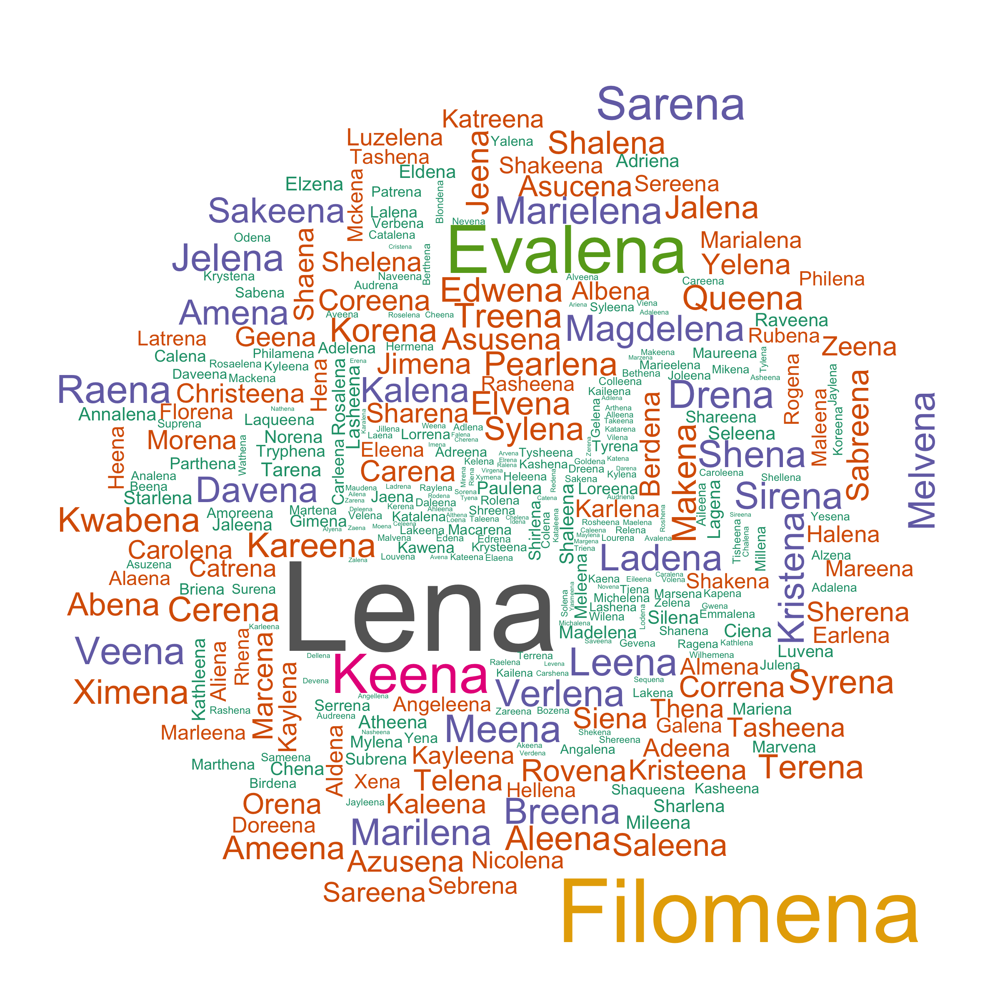

US Baby Name
================

US Baby Name is a project in [kaggle](https://www.kaggle.com/kaggle/us-baby-names), to explore the naming trends of US-born babies. This R markdown is motivated by curiosity and is regarded as a small excecise for time series prediction. Among many interesting questions that can be answered with this database, the key questions in this report are 

1. how many babies will be born in the coming years;

2. how to select a suitable model.

To reproduce this R markdown results, the SQLite database on above kaggle website has to be downloaded and placed in the same folder. Also, `forecast v7.1` is required, which includes `ggplot2` functions for `ts` and the corresponding fit objects.

